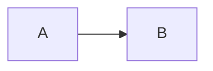

# MDShelf

MDShelf serves the Markdown files in a folder as a small, phone-friendly website.

## Build

```sh
go build -o mdshelf .
```

The executable contains the full web interface. It does not need a separate assets folder. macOS builds need cgo, which Go enables by default, for FSEvents.

Release binaries use Go 1.27. The source needs Go 1.27 or newer.

## Install a release

Each GitHub release contains archives for macOS, Linux, and Windows on AMD64 and ARM64, plus a `SHA256SUMS` file. After extracting an archive on macOS or Linux, install the executable with:

```sh
mkdir -p "$HOME/bin"
/usr/bin/install -m 755 mdshelf "$HOME/bin/mdshelf"
```

Using `install` is preferable to copying over a previously launched executable on macOS because it replaces the binary safely instead of modifying a signed Mach-O file in place.

Release binaries are not notarized or signed with commercial Apple or Microsoft certificates. macOS Gatekeeper or Windows SmartScreen may therefore warn about a downloaded binary. Verify `SHA256SUMS` and build from source if you do not want to approve an unsigned download.

## Use ad hoc mode

Run the executable from the folder you want to read:

```sh
cd /path/to/notes
/path/to/mdshelf
```

You can also pass the folder as the first positional argument:

```sh
/path/to/mdshelf /path/to/notes
```

MDShelf uses port `7331` by default. Choose another port with `-port`:

```sh
/path/to/mdshelf -port 9123 /path/to/notes
```

Then open the local or network URL printed at startup. MDShelf listens on all network interfaces so another device can connect.

MDShelf finds `.md` and `.markdown` files in the folder and its subfolders. It ignores hidden files, hidden folders, and symbolic links. It tracks changes only for Markdown files, using inotify on Linux, FSEvents on macOS, and ReadDirectoryChangesW on Windows. An open document refreshes at once and highlights only changed blocks. If the page is not active, MDShelf waits to show the update until it gets focus. Relative links between Markdown files and local images work in the reader. Language-tagged fenced code blocks use server-side syntax highlighting with matching light and dark themes. Three reading designs are available, each with a light and a dark palette.

## Use daemon mode

Daemon mode keeps a list of Markdown files from different folders. It listens on `127.0.0.1:7332` by default.

Add one file:

```sh
mdshelf add /path/to/notes/guide.md
```

The command starts the daemon when necessary. It prints a stable local URL for the file.

Use these commands to manage the daemon:

```sh
mdshelf list
mdshelf status
mdshelf remove /path/to/notes/guide.md
mdshelf stop
```

The daemon stores its files in the `mdshelf` folder under the user configuration folder. For example, macOS uses `~/Library/Application Support/mdshelf`. Linux usually uses `~/.config/mdshelf`. Windows uses the user configuration folder.

If the daemon runs, stop it before you change its configuration:

```sh
mdshelf stop
```

Create `config.json` in the configuration folder to set network access:

```json
{
  "listenOnAllInterfaces": true,
  "port": 7332,
  "allowedHostnames": ["mentat", "mentat.example.ts.net:7332"]
}
```

The `port` value is optional and defaults to `7332`.

Each `allowedHostnames` entry can include a port. MDShelf ignores that entry port and uses the configured daemon port.

IP address hosts do not need an entry when `listenOnAllInterfaces` is true. Other hostnames must be in `allowedHostnames`.

Start the daemon again by adding a document:

```sh
mdshelf add /path/to/notes/guide.md
```

Use an allowed hostname or network interface IP from another device. For example, use `http://mentat:7332`.

The daemon watches only each registered file. If a file or its parent folder is removed, the daemon keeps the registry row. The reader marks the document as removed. If the file returns, the reader makes it available again.

### Agent review flow

Daemon mode lets a reviewer comment on rendered document sections. Saving a comment publishes it at once.

An agent can publish a file and get a JSON response:

```sh
mdshelf add --json /path/to/notes/implementation-plan.md
```

The response includes the document ID, absolute path, title, stable URL, and current file state. The normal `mdshelf add` command still prints only the URL.

Use this complete reviewer and agent loop:

```sh
mdshelf add --json /path/to/notes/implementation-plan.md
# Give the returned URL to the reviewer. Wait until they finish commenting.
mdshelf review show --json /path/to/notes/implementation-plan.md
# Update the file or answer the reviewer question.
mdshelf review address --message "Updated the storage section." comment_8f31c2
mdshelf review show --json /path/to/notes/implementation-plan.md
```

Select a document section and use its `+` button to add a comment. The form uses the same rail as existing comments. Select a comment to highlight its section. Use Reply, Resolve, or Reopen beside the section or in the Comments panel. Replies stay one level deep. Opening the panel does not change the document text width.

Document status uses these values:

- `needs_review`: The document has no comments.
- `comments`: The document has comments on its current content.
- `updated`: The document changed after the last comment.
- `removed`: The registered file is not available.

`mdshelf review show` prints unresolved comment threads as Markdown. Add `--json` for agent input. Add `--include-resolved` to include resolved comments. Each `review address` call appends an agent reply.

Comment data stays in `reviews.json` in the MDShelf state folder. MDShelf does not write comment files beside the Markdown file. Running `mdshelf remove` keeps comment data. If you add the same canonical path again, MDShelf restores its comments.

Comment writes work only in daemon mode. Ad hoc mode stays read-only. If a daemon does not support comments, stop it and retry the command.

### Install the agent skill

Install the embedded skill into a skills root that your agent supports:

```sh
mdshelf skill install "$HOME/.agents/skills"
```

Use `mdshelf skill print` if your agent uses a different directory layout. MDShelf does not select a default skills directory.

Each document has a separate asset root. MDShelf serves local raster images only from that document's folder. It does not serve another Markdown file from the same folder unless you register that file.

The names `add`, `list`, `remove`, `status`, and `stop` are reserved as the first command value. Use `./add` to serve a folder named `add` in ad hoc mode.

## Extended Markdown

### Footnotes

Use `[^name]` to add a footnote reference. Define the note with `[^name]: Note text`. MDShelf adds linked references and backlinks.

### Math notation

Use `$...$` or `\(...\)` for inline math. Use `$$...$$` or `\[...\]` for display math. MDShelf bundles KaTeX 0.18.4 for offline rendering.

### Alerts and callouts

Start a block quote with `[!NOTE]`, `[!TIP]`, `[!IMPORTANT]`, `[!WARNING]`, or `[!CAUTION]`. MDShelf renders a labeled callout.

### Definition lists

Put a term on one line. Start its definition on the next line with `:`. A term can have more than one definition.

### Front matter

Put YAML between `---` lines or TOML between `+++` lines at the start of a document. The `title` field sets the page title. MDShelf shows other fields in a metadata panel.

### Heading permalinks

Move the pointer over a heading or focus it with the keyboard to show its permalink. The link opens the same document at that heading.

### Advanced code blocks

Every code block has a copy button. Fenced blocks accept Pandoc-style attributes after the language. Use `title="main.go"`, `linenos=true`, `linenostart=20`, and `hl_lines="2 4-6"` to control the display.

### Citations and bibliographies

Set `bibliography: references.bib` in the front matter. The BibTeX file must be beside the Markdown file. Use `[@key]`, `[@key, p. 10]`, or `[@first; @second]` for citations. MDShelf renders a simple author-year style and adds cited entries to a References section.

### Emoji shortcodes

Use GitHub emoji aliases such as `:rocket:`, `:smile:`, and `:+1:`. MDShelf renders Unicode emoji and keeps unknown aliases unchanged.

## Mermaid diagrams

MDShelf renders fenced `mermaid` blocks in ad hoc and daemon modes:

````markdown

````

MDShelf bundles Mermaid 11.17.2 in the executable. Diagram rendering works without a network connection.

## Embedded demo

Select **Demo** at the bottom of the document list to open the feature guide. The build embeds the tracked `demo.md` source file in the executable.

## Reading settings

Select the settings button at the top right to change the design, the appearance, and the syntax theme. MDShelf stores the three choices in browser local storage for the current server address.

A design sets the reading type, the text width, where the file list lives, and where review comments appear:

| Design | Reading type | File list | Comments |
| :--- | :--- | :--- | :--- |
| Ink | Literata, a serif for long prose | Opens over the page | In the right margin, beside the block |
| Signal | IBM Plex Sans, with monospace labels | A rail that stays on screen | In the outline rail and the comments panel |
| Column | Instrument Sans, one column, no panels | Opens as a palette, or with Command-K | Marked on the block, thread below it |

Appearance is System, Light, or Dark. Each design has a light and a dark palette, and automatic syntax themes follow the appearance. MDShelf embeds all fonts, so the designs look the same without a network connection.

## Keyboard navigation

Press `?` to show all keyboard shortcuts.

| Keys | Action |
| :--- | :--- |
| Arrow keys or `h`, `j`, `k`, `l` | Move between Markdown blocks |
| `Home` or `End` | Move to the first or last block |
| `c` | Comment on the active block |
| `/` or Command/Ctrl-K | Open the document list and focus its filter |
| Arrow keys or `j`, `k` in the document list | Select a document |
| `Enter` | Open the selected document |
| `r` | Open or close comments |
| `Escape` | Close the active panel |

The active Markdown block has a short line on its left side.

## Network access

MDShelf has no sign-in screen. Anyone who can reach its port can read its Markdown files and use its controls.

Ad hoc mode listens on all network interfaces. Run it only on a network you trust, and stop it when you finish.

Daemon mode accepts only local requests by default. Set `listenOnAllInterfaces` to accept network requests.

MDShelf checks each request host and origin. Add each network hostname to `allowedHostnames`, or use an interface IP address.

Use the all-interface option only on a trusted network.

## Development

```sh
go test -race ./...
go vet ./...
node --check web/app.js
node --test web/app.test.cjs
```

## Publishing a release

Push `main`, then create and push a semantic version tag:

```sh
git push origin main
git tag -a v0.1.0 -m "MDShelf v0.1.0"
git push origin v0.1.0
```

The release workflow accepts `vMAJOR.MINOR.PATCH` tags only and verifies that the tagged commit belongs to `main`. It tests the code, scans known Go vulnerabilities, builds all supported archives, generates checksums, and creates the GitHub release.

## License

MDShelf is available under the [MIT License](LICENSE). Third-party notices for the released binary are in [THIRD_PARTY_NOTICES](THIRD_PARTY_NOTICES).
