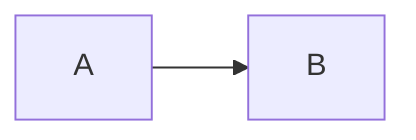

# MDShelf

MDShelf serves the Markdown files in a folder as a small, phone-friendly website.

## Build

```sh
go build -o mdshelf .
```

The executable contains the full web interface. It does not need a separate assets folder. macOS builds need cgo, which Go enables by default, for FSEvents.

Release binaries use Go 1.27. The source needs Go 1.27 or newer.

## Install a release

Each GitHub release contains archives for macOS, Linux, and Windows on AMD64 and ARM64, plus a `SHA256SUMS` file. After extracting an archive on macOS or Linux, install the executable with:

```sh
mkdir -p "$HOME/bin"
/usr/bin/install -m 755 mdshelf "$HOME/bin/mdshelf"
```

Using `install` is preferable to copying over a previously launched executable on macOS because it replaces the binary safely instead of modifying a signed Mach-O file in place.

Release binaries are not notarized or signed with commercial Apple or Microsoft certificates. macOS Gatekeeper or Windows SmartScreen may therefore warn about a downloaded binary. Verify `SHA256SUMS` and build from source if you do not want to approve an unsigned download.

## Use ad hoc mode

Run the executable from the folder you want to read:

```sh
cd /path/to/notes
/path/to/mdshelf
```

You can also pass the folder as the first positional argument:

```sh
/path/to/mdshelf /path/to/notes
```

MDShelf uses port `7331` by default. Choose another port with `-port`:

```sh
/path/to/mdshelf -port 9123 /path/to/notes
```

Then open the local or network URL printed at startup. MDShelf listens on all network interfaces so another device can connect.

MDShelf finds `.md` and `.markdown` files in the folder and its subfolders. It ignores hidden files, hidden folders, and symbolic links. It tracks changes only for Markdown files, using inotify on Linux, FSEvents on macOS, and ReadDirectoryChangesW on Windows. An open document refreshes at once and highlights only changed blocks. If the page is not active, MDShelf waits to show the update until it gets focus. Relative links between Markdown files and local images work in the reader. Language-tagged fenced code blocks use server-side syntax highlighting with matching light and dark themes.

## Use daemon mode

Daemon mode keeps a list of Markdown files from different folders. It listens only on `127.0.0.1:7332`.

Add one file:

```sh
mdshelf add /path/to/notes/guide.md
```

The command starts the daemon when necessary. It prints a stable local URL for the file.

Use these commands to manage the daemon:

```sh
mdshelf list
mdshelf status
mdshelf remove /path/to/notes/guide.md
mdshelf stop
```

The daemon stores its registry and log in the `mdshelf` folder under the user configuration folder. For example, macOS uses `~/Library/Application Support/mdshelf`. Linux usually uses `~/.config/mdshelf`. Windows uses the user configuration folder.

The daemon watches only each registered file. If a file or its parent folder is removed, the daemon keeps the registry row. The reader marks the document as removed. If the file returns, the reader makes it available again.

Each document has a separate asset root. MDShelf serves local raster images only from that document's folder. It does not serve another Markdown file from the same folder unless you register that file.

The names `add`, `list`, `remove`, `status`, and `stop` are reserved as the first command value. Use `./add` to serve a folder named `add` in ad hoc mode.

## Extended Markdown

### Footnotes

Use `[^name]` to add a footnote reference. Define the note with `[^name]: Note text`. MDShelf adds linked references and backlinks.

### Math notation

Use `$...$` or `\(...\)` for inline math. Use `$$...$$` or `\[...\]` for display math. MDShelf bundles KaTeX 0.18.4 for offline rendering.

### Alerts and callouts

Start a block quote with `[!NOTE]`, `[!TIP]`, `[!IMPORTANT]`, `[!WARNING]`, or `[!CAUTION]`. MDShelf renders a labeled callout.

### Definition lists

Put a term on one line. Start its definition on the next line with `:`. A term can have more than one definition.

### Front matter

Put YAML between `---` lines or TOML between `+++` lines at the start of a document. The `title` field sets the page title. MDShelf shows other fields in a metadata panel.

### Heading permalinks

Move the pointer over a heading or focus it with the keyboard to show its permalink. The link opens the same document at that heading.

### Advanced code blocks

Every code block has a copy button. Fenced blocks accept Pandoc-style attributes after the language. Use `title="main.go"`, `linenos=true`, `linenostart=20`, and `hl_lines="2 4-6"` to control the display.

### Citations and bibliographies

Set `bibliography: references.bib` in the front matter. The BibTeX file must be beside the Markdown file. Use `[@key]`, `[@key, p. 10]`, or `[@first; @second]` for citations. MDShelf renders a simple author-year style and adds cited entries to a References section.

### Emoji shortcodes

Use GitHub emoji aliases such as `:rocket:`, `:smile:`, and `:+1:`. MDShelf renders Unicode emoji and keeps unknown aliases unchanged.

## Mermaid diagrams

MDShelf renders fenced `mermaid` blocks in ad hoc and daemon modes:

````markdown

````

MDShelf bundles Mermaid 11.17.2 in the executable. Diagram rendering works without a network connection.

## Embedded demo

Select **Demo** at the bottom of the document list to open the feature guide. The build embeds the tracked `demo.md` source file in the executable.

## Appearance settings

Select the settings button at the top right to change the color theme and syntax theme. Automatic syntax themes match the selected light or dark color theme. MDShelf stores both choices in browser local storage for the current server address.

## Network access

Ad hoc mode has no sign-in screen. Anyone who can reach its port can read the Markdown files it lists. Run it only on a network you trust and stop it when you finish.

Daemon mode accepts only local requests. It checks the request host and origin. Other local processes can still connect to it.

## Development

```sh
go test -race ./...
go vet ./...
node --check web/app.js
```

## Publishing a release

Push `main`, then create and push a semantic version tag:

```sh
git push origin main
git tag -a v0.1.0 -m "MDShelf v0.1.0"
git push origin v0.1.0
```

The release workflow accepts `vMAJOR.MINOR.PATCH` tags only and verifies that the tagged commit belongs to `main`. It tests the code, scans known Go vulnerabilities, builds all supported archives, generates checksums, and creates the GitHub release.

## License

MDShelf is available under the [MIT License](LICENSE). Third-party notices for the released binary are in [THIRD_PARTY_NOTICES](THIRD_PARTY_NOTICES).
