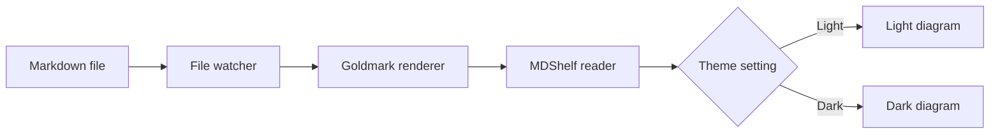
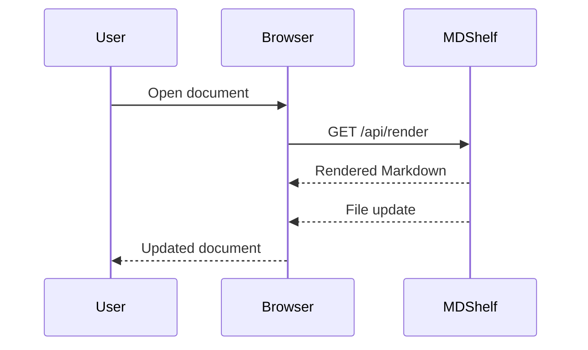
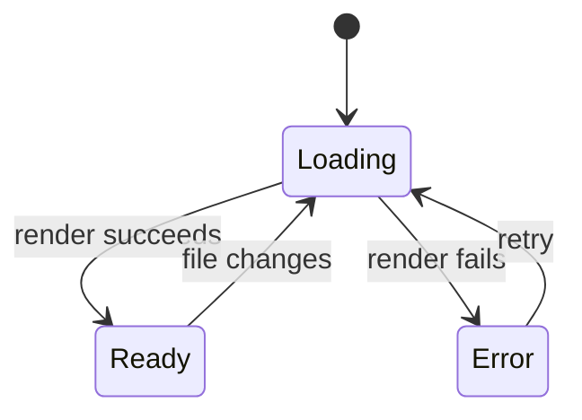

# MDShelf feature demo

This document is part of the MDShelf binary. It works in ad hoc mode and daemon mode.

Use the table of contents to inspect each feature:

- [Markdown primer](#markdown-primer)
- [Front matter](#front-matter)
- [Text and headings](#text-and-headings)
- [Heading permalinks](#heading-permalinks)
- [Lists and tasks](#lists-and-tasks)
- [Definition lists](#definition-lists)
- [Quotes and rules](#quotes-and-rules)
- [Alerts and callouts](#alerts-and-callouts)
- [Document reviews](#document-reviews)
- [Tables](#tables)
- [Footnotes](#footnotes)
- [Citations and bibliography](#citations-and-bibliography)
- [Links and images](#links-and-images)
- [Syntax highlighting](#syntax-highlighting)
- [Advanced code blocks](#advanced-code-blocks)
- [Math notation](#math-notation)
- [Mermaid diagrams](#mermaid-diagrams)
- [Emoji shortcodes](#emoji-shortcodes)

---

## Markdown primer

MDShelf renders CommonMark and GitHub Flavored Markdown through Goldmark. It adds syntax highlighting, Mermaid diagrams, local navigation, and live updates.

| Feature | Markdown form | Result |
| :--- | :--- | :--- |
| Heading | `## Heading` | A heading with a route fragment |
| Heading link | Point to a heading | A stable MDShelf route |
| Front matter | YAML between `---` or TOML between `+++` | A title and metadata panel |
| Emphasis | `*text*` or `_text_` | *Emphasized text* |
| Strong text | `**text**` | **Strong text** |
| Strikethrough | `~~text~~` | ~~Removed text~~ |
| Inline code | `` `value` `` | `value` |
| Link | `[label](https://example.com)` | [Example](https://example.com) |
| Automatic link | A plain web address | https://example.com/docs |
| Quote | `> text` | A block quote |
| Callout | `> [!NOTE]` | A labeled alert or note |
| Lists | `- item` or `1. item` | Ordered and unordered lists |
| Definition | `Term` followed by `: Meaning` | A term and its meaning |
| Task | `- [x] item` | A task list item |
| Table | Pipes and a header row | A scrollable table |
| Footnote | `text[^name]` and `[^name]: note` | A linked note at the end |
| Citation | `[@reference-key]` | An author-year link and reference entry |
| Code block | A fenced block with a language | Highlighted source code |
| Code options | Attributes after the language | A title, line numbers, and marked lines |
| Math | `$...$` or `$$...$$` | Inline or display notation |
| Emoji | `:rocket:` | A GitHub emoji character |
| Diagram | A fenced `mermaid` block | A rendered Mermaid diagram |
| Image | `` | A local or remote raster image |
| Rule | `---` | A thematic break |

Local images can use PNG, JPEG, GIF, or WebP files. Relative Markdown links open inside MDShelf.

## Front matter

The metadata panel below this document's title comes from YAML front matter. The `title` field also sets the browser and sidebar title.

```yaml
---
title: Release notes
date: 2026-08-26
tags:
  - release
  - documentation
---
```

TOML front matter uses plus-sign delimiters:

```toml
+++
title = "Release notes"
date = 2026-08-26
tags = ["release", "documentation"]
+++
```

MDShelf hides the front matter source. It shows all fields except `title` in the metadata panel.

## Text and headings

### Third-level heading

#### Fourth-level heading

##### Fifth-level heading

###### Sixth-level heading

A paragraph can contain *emphasis*, **strong text**, ***both styles***, ~~strikethrough~~, and `inline code`.

Reserved Markdown characters can be escaped: \*not emphasized\*, \# not a heading, and \[not a link\].

Unicode text works without extra settings: café, Ελληνικά, 日本語, العربية, and 🚀.

This line ends with two spaces.  
This text starts on the next line.

## Heading permalinks

Move the pointer over any heading to show its `#` permalink. Keyboard focus also keeps the control visible.

Select a permalink to update the MDShelf route and move to that heading. The route opens the same heading after a reload.

## Lists and tasks

- A top-level item
  - A nested item
    - A third-level item
  - Another nested item
- A final top-level item

1. Inspect the document.
2. Open the appearance settings.
3. Select a reading design.
   1. Select a syntax theme.
   2. Reload the page.
4. Confirm that both choices remain selected.

- [x] Render CommonMark
- [x] Render GitHub Flavored Markdown
- [x] Highlight source code
- [x] Render Mermaid diagrams
- [ ] Add more Markdown extensions

## Definition lists

MDShelf
: A local reader for Markdown documents.
: A daemon that can watch selected files.

Goldmark
: The Go parser that converts Markdown into HTML.

Live update
: A browser update that appears after a watched file changes.

Definition text can include **emphasis**, `inline code`, and [links](https://commonmark.org/).

## Quotes and rules

> MDShelf keeps Markdown reading local and direct.
>
> > Nested quotes also work.
>
> A quote can include **formatted text**, `code`, and lists.
>
> - First point
> - Second point

---

The rule above separates sections without extra HTML.

## Alerts and callouts

Use a supported marker on the first line of a block quote.

> [!NOTE]
> Notes add useful context without interrupting the main steps.

> [!TIP]
> Tips show an optional way to get a better result.

> [!IMPORTANT]
> Important details can affect whether a procedure succeeds.

> [!WARNING]
> Warnings identify a condition that can cause a problem.

> [!CAUTION]
> Cautions identify a condition that can cause data loss or another serious result.

Normal block quotes keep their standard appearance.

## Document reviews

MDShelf daemon mode lets reviewers add comments to rendered sections. Comments publish when saved and stay outside the source tree.

> [!NOTE]
> The embedded demo cannot accept review comments. Add a Markdown file to daemon mode to use the review controls.

```sh
mdshelf add --json /path/to/document.md
mdshelf review show --json /path/to/document.md
```

The document list shows comment status and unresolved comment counts. Agents can append replies with `mdshelf review address`. Reviewers can reply, resolve, or reopen beside the section or in the Comments panel.

## Tables

| Component | Input | Output | Status |
| :--- | :---: | ---: | :---: |
| Goldmark | Markdown | HTML | Ready |
| Chroma | Source code | Token classes | Ready |
| Mermaid | Diagram text | SVG | Ready |
| File watcher | File events | Live update | Ready |

Long tables use a horizontal scroll area on narrow screens.

## Footnotes

A footnote keeps supporting details out of the main sentence.[^footnote-source] The same note can have more than one reference.[^footnote-source]

Footnotes can also contain more than one paragraph.[^footnote-detail]

[^footnote-source]: MDShelf uses Goldmark footnotes. Select the number to move between the reference and this note.

[^footnote-detail]: The first paragraph can contain **formatting**, links, and `inline code`.

    Indent the next paragraph to keep it in the same footnote.

## Citations and bibliography

Markdown began as a plain-text formatting syntax [@gruber2004markdown]. CommonMark later defined a detailed specification [@macfarlane2024commonmark, section 1.2].

Put a sibling BibTeX file in the `bibliography` front matter field. Use more than one key in a citation group like this: [@gruber2004markdown; @macfarlane2024commonmark].

MDShelf uses a simple author-year format. It adds cited entries to the References section at the end of the document.

## Links and images

MDShelf supports [normal web links](https://commonmark.org/), automatic links such as https://github.com, and heading links such as [Tables](#tables).

A regular document can use relative links and images:

```markdown
[Open another document](../guides/setup.md#getting-started)

```

MDShelf rewrites these paths so navigation and local raster images stay inside the server rules.

## Syntax highlighting

Select a syntax theme from the settings popup. MDShelf uses the language name after the opening fence.

### Go

```go
package main

import "fmt"

type Document struct {
    Title string
    Ready bool
}

func main() {
    document := Document{Title: "MDShelf", Ready: true}
    fmt.Printf("%s ready: %t\n", document.Title, document.Ready)
}
```

### TypeScript

```typescript
type Theme = "system" | "light" | "dark";

const settings: Readonly<{ theme: Theme; syntax: string }> = {
  theme: "system",
  syntax: "github-auto",
};

console.log(`${settings.theme}: ${settings.syntax}`);
```

### JSON

```json
{
  "name": "mdshelf",
  "features": ["markdown", "highlighting", "mermaid", "live updates"],
  "offline": true
}
```

### Shell

```bash
mdshelf add ./README.md
mdshelf list
mdshelf status
```

An indented block renders as plain code:

    no language tag
    no syntax colors

## Advanced code blocks

Every code block has a copy button. Add Pandoc-style attributes after the language to control the other tools.

```go {title="server.go" linenos=true hl_lines="2 5-7"}
package main

import "net/http"

func main() {
    handler := http.FileServer(http.Dir("."))
    http.ListenAndServe(":7331", handler)
}
```

| Attribute | Example | Result |
| :--- | :--- | :--- |
| `title` | `title="server.go"` | Shows a file-name label |
| `linenos` | `linenos=true` | Shows line numbers |
| `linenostart` | `linenostart=20` | Sets the first line number |
| `hl_lines` | `hl_lines="2 5-7"` | Marks lines or line ranges |

## Math notation

Inline math can use dollar delimiters, such as $E = mc^2$, or slash delimiters, such as \(a^2 + b^2 = c^2\).

Display math can use double-dollar delimiters:

$$
\int_0^1 x^2\,dx = \frac{1}{3}
$$

Slash delimiters also work for display math:

\[
\sum_{k=1}^{n} k = \frac{n(n+1)}{2}
\]

MDShelf bundles KaTeX, so math rendering works without a network connection.

## Mermaid diagrams

Mermaid diagrams take their colors from the selected design and appearance.

### Flowchart



### Sequence diagram



### State diagram



## Emoji shortcodes

MDShelf converts GitHub emoji aliases into Unicode characters: :rocket: :sparkles: :+1: :warning: :heart:.

Unknown aliases such as `:not_a_real_emoji:` stay unchanged. Shortcodes inside inline code and code blocks also stay unchanged.

---

## End of demo

Open the settings popup to compare the three designs, the light and dark appearance, and the syntax themes. Return to a document from the document list when finished.
